<h2>🚀 PROJECT DATABASE</h2>

  

# 👋 Hello, I'm YOUR NAME

> CSBS Student • Developer

<!-- 👇 இங்கே Skills code -->

### ⚡ TECH STACK

&nbsp;&nbsp;

&nbsp;&nbsp;

&nbsp;&nbsp;

&nbsp;&nbsp;

&nbsp;&nbsp;

&nbsp;&nbsp;

  

&nbsp;&nbsp;

&nbsp;&nbsp;

&nbsp;&nbsp;

<!-- 👆 Skills ends -->

## 🚀 Projects

Your projects here...

